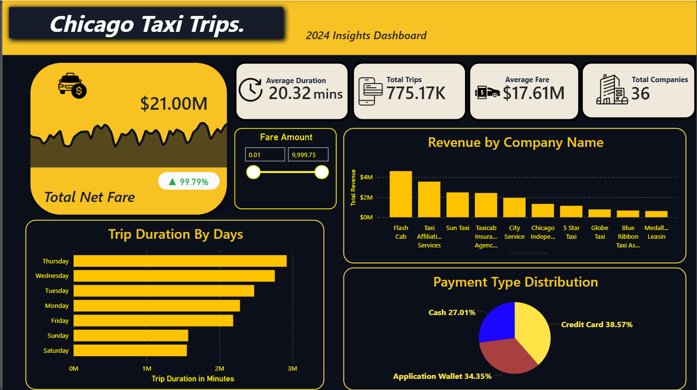
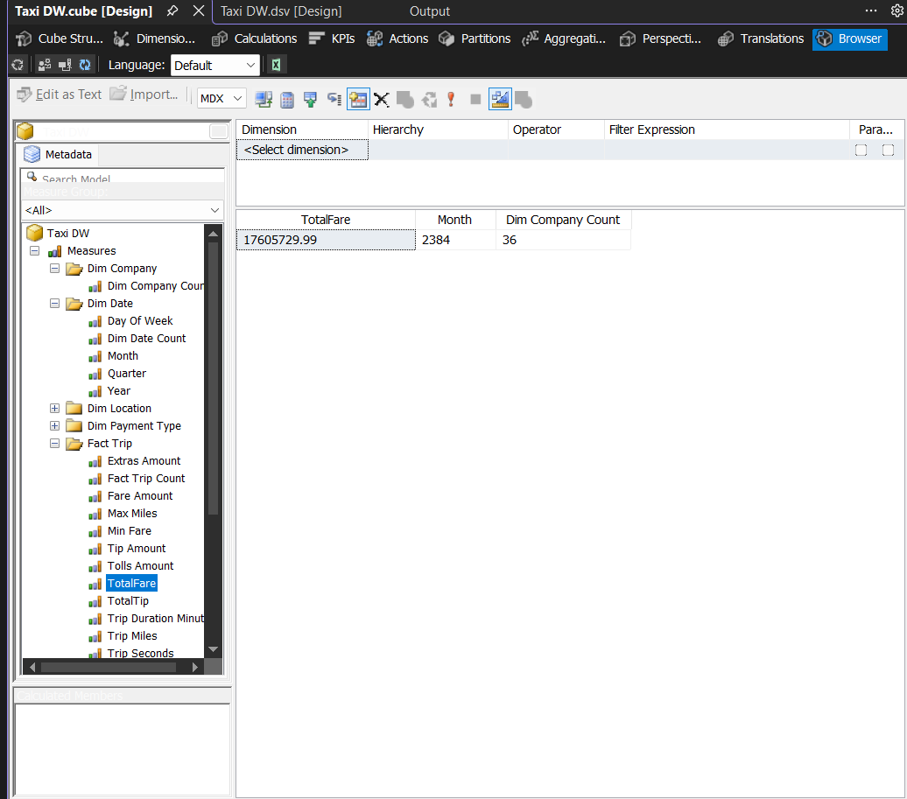
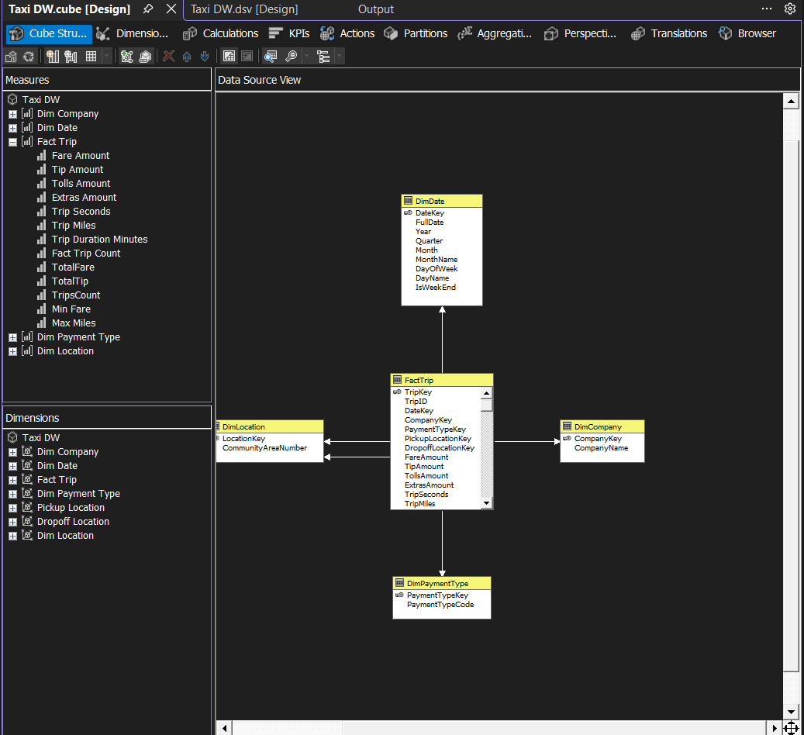
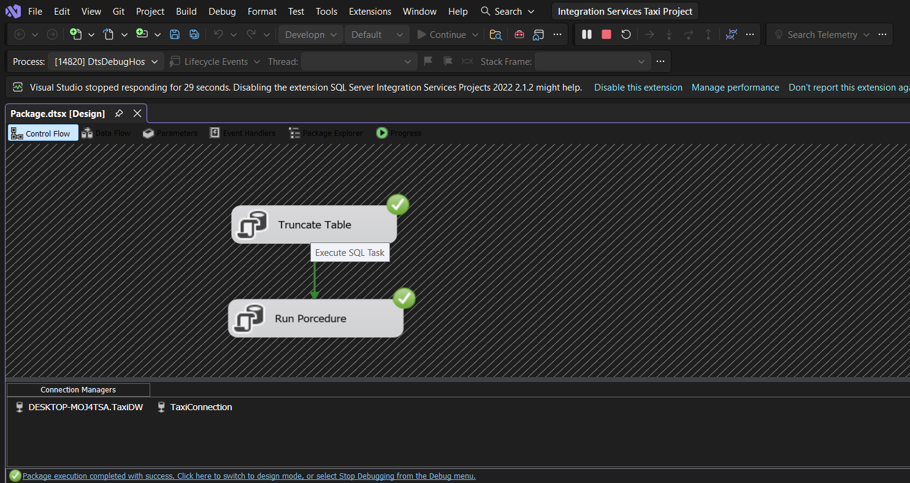
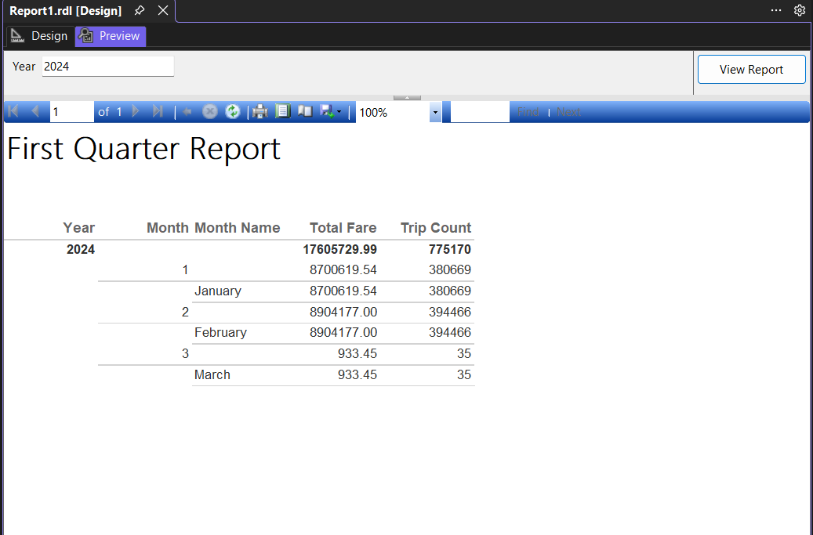

# 🚖 Chicago Taxi Trips — End-to-End Microsoft BI Project

> A complete, production-style Business Intelligence pipeline built from scratch on **100,000+ rows** of real, messy, public data — covering every layer of the Microsoft BI stack: SQL Server → SSIS → SSAS → SSRS → Power BI.

---

## 📸 Dashboard Preview



---

## 🗺️ Architecture Overview

```
Chicago Data Portal (Raw CSV)
          │
          ▼
┌─────────────────────────┐
│   SQL Server            │  ← landing.TaxiRaw
│   Landing Layer         │     All columns ingested as NVARCHAR
└─────────────────────────┘
          │
          ▼
┌─────────────────────────┐
│   T-SQL Cleaning        │  ← staging.usp_CleanTaxi
│   Staging Layer         │     • Remove NULLs & duplicates
│                         │     • Cast & standardise types
│                         │     • Derive trip_duration_minutes
└─────────────────────────┘
          │
          ▼
┌─────────────────────────┐
│   Star Schema DW        │  ← dw.FactTrip + 4 Dimension Tables
│   (SQL Server)          │     DimDate | DimCompany
│                         │     DimPaymentType | DimLocation
└─────────────────────────┘
          │
          ▼
┌─────────────────────────┐
│   SSIS Package          │  ← Execute SQL Tasks orchestrating
│   ETL Automation        │     truncate → clean → load pipeline
└─────────────────────────┘
          │
          ▼
┌─────────────────────────┐
│   SSAS Tabular          │  ← Semantic model with DAX measures
│   Semantic Model        │     Live-connected to Power BI
└─────────────────────────┘
          │
     ┌────┴────┐
     ▼         ▼
┌─────────┐ ┌──────────────┐
│  SSRS   │ │   Power BI   │
│ Reports │ │  Dashboard   │
└─────────┘ └──────────────┘
```

---

## ⭐ Dimensional Model — Star Schema

### Fact Table — `dw.FactTrip`

> **Grain:** One row = one completed taxi trip in Chicago

| Column | Type | Description |
|---|---|---|
| `TripKey` | INT IDENTITY | Surrogate primary key |
| `TripID` | NVARCHAR | Natural key (retained for traceability) |
| `DateKey` | INT (FK) | Links to `DimDate` |
| `CompanyKey` | INT (FK) | Links to `DimCompany` |
| `PaymentTypeKey` | INT (FK) | Links to `DimPaymentType` |
| `PickupLocationKey` | INT (FK) | Links to `DimLocation` |
| `DropoffLocationKey` | INT (FK) | Links to `DimLocation` |
| `FareAmount` | DECIMAL | Metered fare in USD |
| `TipAmount` | DECIMAL | Tip amount (0 for non-card payments) |
| `TollsAmount` | DECIMAL | Toll charges |
| `TripSeconds` | INT | Raw trip duration in seconds |
| `TripMiles` | DECIMAL | Distance travelled |
| `TripDurationMinutes` | DECIMAL | Derived: `TripSeconds / 60` |

### Dimension Tables

| Table | Key Column | Natural Key | Description |
|---|---|---|---|
| `DimDate` | `DateKey` (YYYYMMDD) | Date | Full calendar attributes |
| `DimCompany` | `CompanyKey` | CompanyName | Taxi company (SCD not applied) |
| `DimPaymentType` | `PaymentTypeKey` | PaymentTypeCode | Cash, Credit Card, etc. |
| `DimLocation` | `LocationKey` | CommunityAreaNumber | Chicago community areas 1–77 |

---

## 🛠️ Tools & Technologies

| Layer | Tool | Purpose |
|---|---|---|
| Database | SQL Server 2022 | Data warehouse host |
| Querying | SSMS | Script execution & profiling |
| Data Cleaning | T-SQL Stored Procedures | Staging pipeline logic |
| ETL Orchestration | SSIS (Visual Studio SSDT) | Automated load pipeline |
| Semantic Model | SSAS Tabular | DAX measures & relationships |
| Paginated Reports | SSRS | Q1 Revenue Summary report |
| Dashboard | Power BI Desktop | Interactive live-connected visuals |

---

## 📐 DAX Measures (SSAS Tabular)

```dax
Total Fare        = SUM(FactTrip[FareAmount])
Total Tips        = SUM(FactTrip[TipAmount])
Trip Count        = COUNTROWS(FactTrip)
Avg Fare Per Trip = DIVIDE([Total Fare], [Trip Count])
Avg Trip Miles    = AVERAGE(FactTrip[TripMiles])
```

---

## 📊 Power BI Dashboard Features

| Visual | Description |
|---|---|
| **KPI Cards** | Total Fare & Trip Count at a glance |
| **Line Chart** | Total Fare trend by Month (calendar-sorted) |
| **Bar Chart** | Top 10 Companies by Total Fare |
| **Donut Chart** | Trip Count breakdown by Payment Type |
| **Year Slicer** | Filters all visuals simultaneously |
| **Live Connection** | Directly connected to SSAS Tabular — no imported data |

---

## 📋 SSRS Paginated Report — `Rpt_Q1_Revenue`

A monthly revenue summary for Q1 featuring:
- Columns: Month, Trip Count, Total Fare, Avg Fare Per Trip
- Dynamic `@Year` dropdown parameter
- Grand total row at the bottom of the report

---

## 🔍 Data Quality Issues Handled

| Issue | Fix Applied |
|---|---|
| NULL company names | Replaced with `'Unknown'` |
| Inconsistent company name casing | `LTRIM` / `RTRIM` + string standardisation |
| Zero or NULL fare amounts | Filtered out in staging |
| Zero or NULL trip seconds | Filtered out in staging |
| Zero or NULL trip miles | Filtered out in staging |
| Duplicate trip IDs | Deduplicated via `ROW_NUMBER()` windowed function |
| Tips on non-card payments | Set to `0` (business rule enforced) |
| All landing columns stored as string | Cast to proper types in staging stored procedure |

---

## 🚀 Getting Started

### Prerequisites

| Software | Version | Notes |
|---|---|---|
| SQL Server | 2019 or 2022 | Developer Edition (free) |
| SSMS | 19+ | For running SQL scripts |
| Visual Studio | 2019 or 2022 | With SSDT workload installed |
| SSAS Tabular Extension | Latest | Available via VS Extensions Marketplace |
| SSRS Extension | Latest | Available via VS Extensions Marketplace |
| Power BI Desktop | Latest | Free from Microsoft Store |


## 📸 Screenshots

| Power BI Dashboard | SSAS Tabular Model |
|---|---|
|  |  | 

| SSIS Package | SSRS Q1 Report |
|---|---|
|  |  |

---

## 🤝 Connect

If you found this project useful or want to discuss BI development, feel free to reach out!

[](https://www.linkedin.com/in/YOUR-LINKEDIN-USERNAME](https://www.linkedin.com/in/mariam-ankeeb-046581317/))

---

## Author
Mariam Ankeeb
